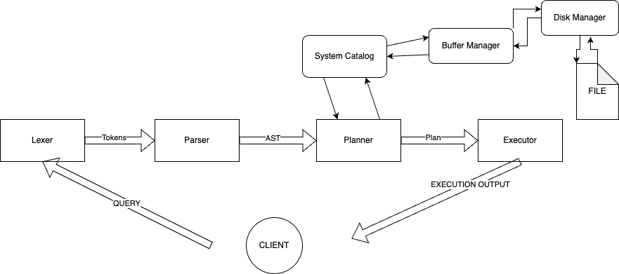
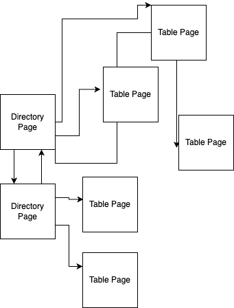
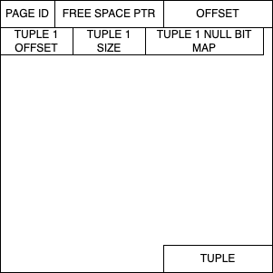
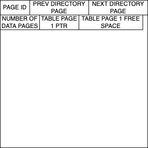

# QuasDB

QuasDB is a learning project SQL database. Not meant for handling any real workloads. Currently it implements a subset of SQL features with more planning to be added in the future.

## Features

QuasDB currently is a WIP and is not thread safe at the time being. Addionally transactions are not supported at the moment but plan to be added in the future. Here is a summary of the availble SQL features with more info being available [here](https://github.com/dylan-p-wong/quasdb/docs).

Statements
- CREATE TABLE
- DROP TABLE
- SELECT
- INSERT
- UPDATE
- DELETE

Other
- Joins (Currently only inner join and outer join are supported)
- Order By
- Limit
- Projections
- Filters

## Usage

Below is a sample CMakeLists.txt for including QuasDB in a project.
```
cmake_minimum_required(VERSION 3.14)
project(repl)

set(CMAKE_CXX_STANDARD 17)

include(FetchContent)
FetchContent_Declare(
  quasdb
  GIT_REPOSITORY https://github.com/dylan-p-wong/quasdb.git
)

FetchContent_MakeAvailable(quasdb)

add_executable(repl main.cc)

target_link_libraries(repl
  PRIVATE
    quas
)

```
Example usage in a C++ file. In this case a file named test.db will be created in the same directory as the executable.
```
#include "db/quas.h"

int main() {
  QuasDB db{"test"}; // Data is stored in one file name test.db
  db.Execute("SELECT * FROM table1");
}

```
The database file can be deleted
```
QuasDB db{"test"};
db.Delete();
```

## Planned Features
- Transactions
- WAL & Recovery
- More SQL Features

&nbsp;

# Design

QuasDB implements a pretty simple database design with a basic lexer, parser, planner and executor.

Below is the query flow and main interacting components.



## Lexer

The lexer is fairly simple. It will consume white space and then get the next string, It will try and then match the string to a keyword or other value or else it will be considered a identifer.

## Parser

The parser will parser the statements into an abstract syntax tree. It will create an expression tree in any places where expressions are used in the statement.

## Planner

The planner will take the abstract syntax tree and create plan nodes depending on the various statements and clauses. Currently indexes have not been added so every query will include sequential scans of the table. This will likely change in the future.

## Optimizer

There is currently no optimizer.

## Exectuor

The executor uses the materialization model for queries. Bascilly the tuple values are stored in memory and collected all at once at each node while being brought up the execution tree. This is bad for workloads with large queries so is a temporary solution for the time being.

## Buffer Manager

The buffer manager is pretty simple and just uses random eviction on page when full. 

## Disk Manager

The disk manager is responsible for storing the pages of data. There is two types of pages in use. Tables pages and directory pages.



Table Page
- Contain the tuples and a header with information about the page
- Is a slotted page layout 



Directory Page
- Contains pointers to the next and previous directory page
- Contains pointers to table pages that contain the table data



Tuple Layout
- NULLS in tuples are handled in a null bit map within the tuple info. A column will be set to NULL if it is a 1 in the bit map
- Data is stored just linearly and column offset is held in the system catalog to know where to and how far to read for the data

## System Catalog
- The system catalog stores the table and column information
- It uses the table methods to store its own info in 2 tables, systeminfo and column info
- systeminfo stores information about what tables there are (name, fisrt_directory_page, number of columns)
- columninfo stores information about what columns there are (table name, column name, data type, offset, column size, nullable, other restrictions)
- On loading the database it will either get or create a new systeminfo directory page and columninfo page on pages 0 and 1 respectively.
- Then get the tuples in these pages using the hardcoded tables and load the tables and columns from disk into memory

## Main Resources Used

- https://github.com/erikgrinaker/toydb
- https://www.youtube.com/playlist?list=PLSE8ODhjZXjbohkNBWQs_otTrBTrjyohi
- https://cs186berkeley.net/fa20/resources/static/notes/n02-DisksFiles.pdf
- https://www.interdb.jp/pg/pgsql05.html#_5.2.
  